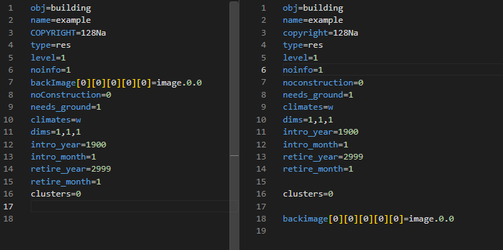
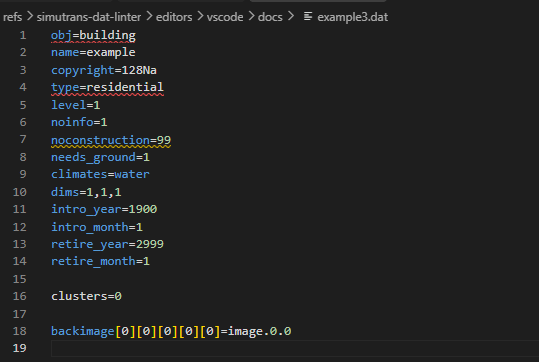
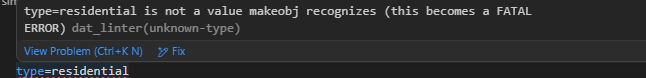
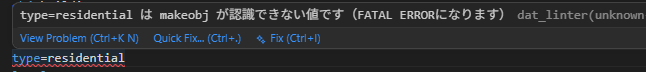

# Simutrans dat_linter (VSCode Extension)

Syntax highlighting, formatting, and parameter validation for Simutrans addon `.dat` files.

# Features

## Syntax highlighting

Highlights keys such as `obj=building` for readability, plus known enum-like values:
`waytype`/direction suffixes (e.g. `[s]`, `[ne]`), building/factory `type` values,
factory `location` values, `climates` values, and the skin `name` values used by
built-in `menu`/`cursor`/`symbol`/`misc`/`ground` objects. Because a `.dat` grammar
can't track which obj type a given line belongs to, these value categories are
flattened across all obj types rather than validated per obj type -- `dat_linter lint`
remains the source of truth for whether a value is actually valid where it's used.

## Snippets

Type an obj form such as `buidling=res` to generate a template for that addon.

## Formatting *

Normalizes parameter order and letter case.

## Key/value completion *

Suggests valid keys for the current obj type, and valid values for keys such as `waytype=`, `direction=`, `type=`, or `location=`.

## Parameter check (lint) *

Flags missing parameters and value mistakes.

## Language switching *

Switch between English and Japanese messages.

## Dependency

Features marked with * require [`dat_linter`](https://github.com/128na/simutrans-dat-linter) to be installed.

This extension does not bundle `dat_linter` itself. Install it separately beforehand and make sure it's on your PATH.

- Installation: https://github.com/128na/simutrans-dat-linter
  (download the executable for your OS from the releases page)
- The `--format json` option requires `dat_linter 0.1.2` or later. This extension will not work with older versions.
- Key/value completion is powered by `dat_linter keys --format json`, which requires a `dat_linter` build that includes the `known_values.per_obj_type` field (added after v0.2.0; not yet in a tagged release as of this writing). On an older version, completion is silently disabled (check the "Simutrans dat_linter" output channel for details) while syntax highlighting, formatting, and lint keep working normally.

## Migrating from the old extension (`128na/simutrans-vscode-extention`)

The author (128na) previously published a separate VSCode extension,
[`128na/simutrans-vscode-extention`](https://github.com/128na/simutrans-vscode-extention) (CC0), which also provides syntax highlighting and snippets for `.dat` files.
Since both extensions contribute a language definition/grammar for `.dat`, **having both installed at the same time can make highlighting unstable**, as which language ID/grammar actually applies depends on VSCode's resolution order.

As the successor from the same publisher (128na), we recommend uninstalling the old extension once you've adopted this one.
The lint (Problems panel) and Document Formatting features are implemented independently of language ID (a filename-based selector, `{pattern: "**/*.dat"}`), so they work the same whether or not the old extension is still installed.

---

# Simutrans dat_linter (VSCode 拡張)

Simutrans アドオンの `.dat` を色分けして見やすくしたり、フォーマット、パラメーターの不備をチェックできる拡張です。

# 機能

## シンタックスハイライト

`obj=building` などのキーを見やすく色分けするほか、既知の列挙値も色分けします:
`waytype` や `[s]`/`[ne]` などの方角サフィックス、building/factory の `type` 値、
factory の `location` 値、`climates` 値、`menu`/`cursor`/`symbol`/`misc`/`ground`
といった組み込みobj用のスキン `name` 値です。`.dat` の文法定義では今どのobj種別の
行なのかを追跡できないため、これらの値カテゴリはobj種別ごとに区別せず全obj種別分を
まとめて色分けしています。実際にその行のobj種別で有効な値かどうかの最終判定は
引き続き `dat_linter lint` が担います。

## スニペット

`buidling=res` などobj形式を入力するとそのあアドオンのテンプレートを生成できます。

## フォーマット ※

パラメーターの順序を整えたり大文字・小文字を整えます。

## キー・値の入力補完 ※

現在の obj 種別に応じたキー名の候補、および `waytype=`・`direction=`・`type=`・`location=` などのキーに応じた既知の値の候補を提示します。

## パラメーターチェック（lint） ※

パラーメーターの不足や値のミスを指摘します。

## 言語切り替え ※

英語・日本語表示の切り替えができます。

## 依存ツール

※の機能を使うには [`dat_linter`](https://github.com/128na/simutrans-dat-linter) の導入が必要です。

この拡張は `dat_linter` 本体を同梱しません。事前に別途インストールし、PATH に通しておく必要があります。

- 本体・インストール方法: https://github.com/128na/simutrans-dat-linter
  （リリースページから OS にあった実行ファイルをダウンロードしてください）
- `--format json` オプションは `dat_linter 0.1.2` 以降が対応しています。それより古いバージョンではこの拡張は動作しません。
- キー・値の入力補完は `dat_linter keys --format json` の `known_values.per_obj_type` フィールドを利用しており、これを含むバージョン（v0.2.0以降の未リリースビルド。この文章を書いている時点ではまだタグ付きリリースはありません）が必要です。それより古いバージョンでは補完機能のみ静かに無効化されます（詳細は "Simutrans dat_linter" 出力チャンネルを参照）。シンタックスハイライト・フォーマット・lint は引き続き通常通り動作します。

## 旧拡張(`128na/simutrans-vscode-extention`)からの移行

作者（128na）が以前公開していた別のVSCode拡張
[`128na/simutrans-vscode-extention`](https://github.com/128na/simutrans-vscode-extention)（CC0）にも、`.dat` 向けのシンタックスハイライト・スニペットが含まれています。
両拡張がともに `.dat` に対して言語定義・グラマーを提供するため、**両方を同時にインストールしていると、どちらの言語ID/グラマーが実際に使われるかVSCode側の解決順に依存し、ハイライト表示が不安定になることがあります**。

同一 publisher（128na）による後継として、この拡張の採用後は旧拡張のアンインストールを推奨します。
lint（Problems パネル表示）・Document Formatting の機能は言語ID に依存しない実装（`{pattern: "**/*.dat"}` によるファイル名ベースのセレクタ）のため、旧拡張を入れたままにするかどうかに関わらず、これらの機能自体は影響を受けません。
